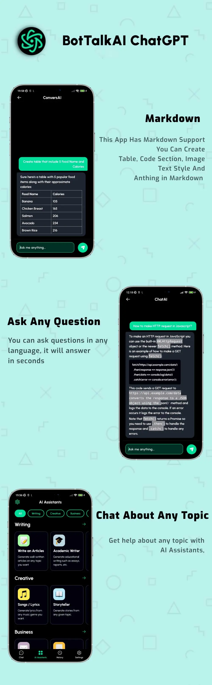

Absolutely, here's an expanded version for your GitHub readme:

## BotTalkAI Chat App - Your Ultimate Conversational Partner

Welcome to the BotTalkAI Chat App, an exceptional creation developed using Kotlin Jetpack Compose. This application redefines the way we converse with technology, offering a rich and immersive experience that combines the power of AI with the elegance of Compose.

### Features:

- **Ask Anything to AI:** Have a burning question or a topic you're curious about? BotTalkAI Chat App is your go-to solution. Our advanced AI model is equipped to provide insightful and accurate responses, giving you the information you seek.

- **Diverse Topic Coverage:** From the latest in technology to the depths of history, from scientific queries to artistic discussions – this app covers a vast array of categories. Whatever your interest, you'll find a stimulating conversation partner here.

- **Multilingual Conversations:** Language barriers are a thing of the past. Engage in conversations in any language you're comfortable with. Our AI comprehends and responds fluently, enabling natural interactions regardless of linguistic preferences.

### Why Choose BotTalkAI ChatGPT AI App?

- **Seamless User Interface:** Built with Kotlin Jetpack Compose, the app boasts a modern and intuitive interface. It adapts flawlessly to various devices, ensuring a visually appealing experience across the board.

- **Curiosity Unleashed:** Unlock endless possibilities for learning, brainstorming, and exploring ideas. The app encourages you to let your curiosity run wild – there's no question too big or small.

- **Human-like Interactions:** The AI's responses are designed to mimic human conversation, making interactions engaging and relatable. It's like having a knowledgeable companion right at your fingertips.

### Getting Started:

1. **Download the App:** Get started by downloading the BotTalkAI Chat App from [(https://www.technovimal.in/contact)].
   
2. **Open and Chat:** Launch the app and begin your AI-powered conversation journey. Type in your questions, thoughts, or topics of interest to initiate a dialogue.

3. **Explore Categories:** Feel free to explore different categories using keywords. Dive deep into discussions that align with your interests.

### Contribution:

We welcome contributions to enhance and refine the BotTalkAI Chat App. If you're interested in adding features, improving the UI, or enhancing the AI's capabilities, please feel free to contribute. Refer to our [contribution guidelines](https://www.technovimal.in/contact) for more details.

### Let's Connect:

Have feedback, questions, or suggestions? We'd love to hear from you! Reach out to us on [Twitter](https://twitter.com/vimalvishwakar6) or [email](technovimalin@gmail.com).

Experience the future of conversations with the BotTalkAI Chat App. Download now and start chatting away!
